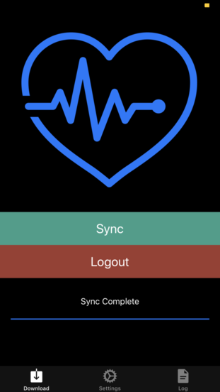
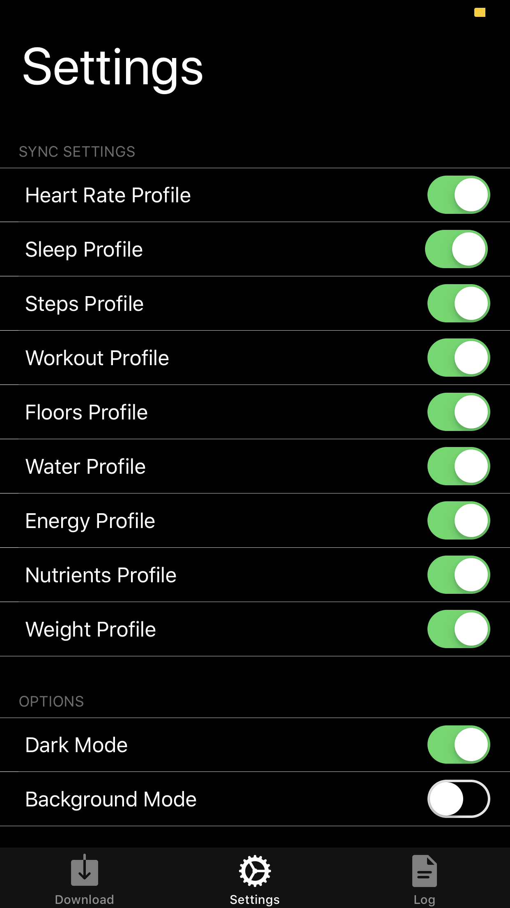
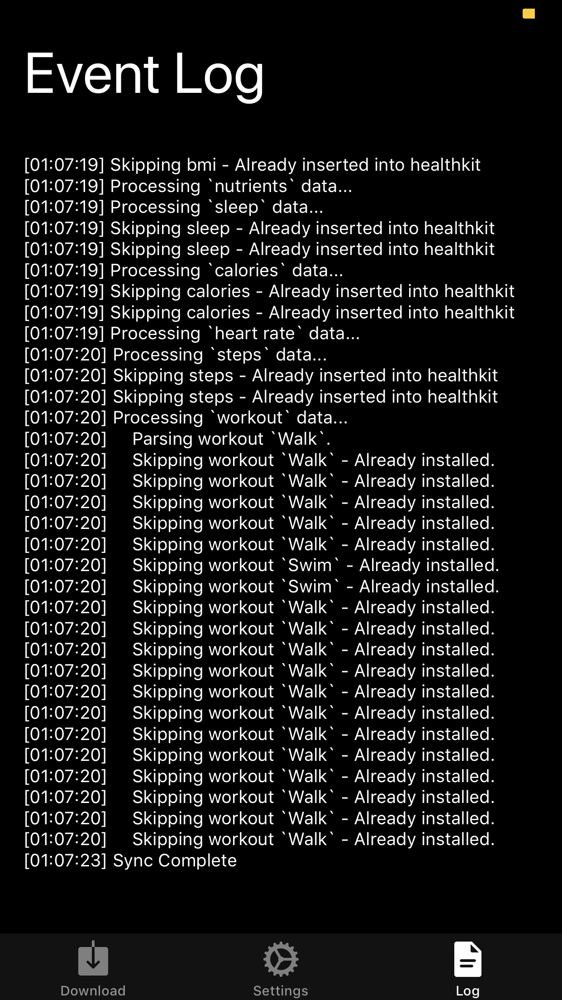
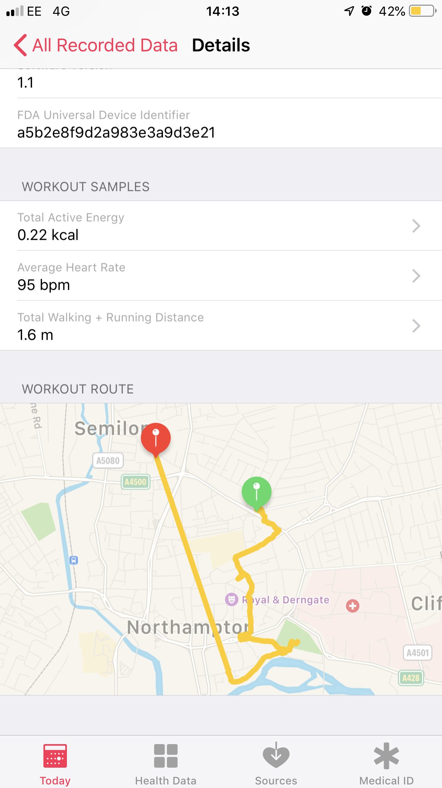

# FitbitImport

IOS application that bridges the gap between Fitbit data and HealthKit. Through Fitbit's api plenty of data can be requested through the Oauth service.

## Features

 The app can be used to retrieve at different resolutions:

  * Steps (3 days)
  * Sleep (3 days)
  * Floors Climbed (3 days)
  * Workouts (20 recent workouts)
  * Heart Rate (3 days)
  * Resting Heart Rate (3 days)
  * Water (3 days)
  * Energy Burnt (3 days)
  * Nutrients consumed (3 days)
    * Carbs
    * Protein
    * Sodium
    * Fat
    * Fiber
  * Body Mass Index (3 days)
  * Weight (3 days)

  As well as the above features, the app is designed to backup user data as historic data, allowing the user to remove the app and restore data back to the device.

  Detection of data that has been added to HealthKit allows less requests to the API, exhausting the API rate limit at a much lower rate.

## Updates

  * Added support for high resolution step data for historic data over 3 days.

  * Added better detection of what HealthKit has already got in memory, therefore eliminating duplication of data and lower API requests.

## Todo

  * Add background support with notification updates

  * Add more support for different measurements based on where user is based. (Metric/Imperial)

  * Alter interface - settings colours and change "Distance Profile" to Workouts. - Complete

  * Use Fitbit's subscription model to poll data for better management.

  * Detect bluetooth for a better user experience and to avoid errors in data.
